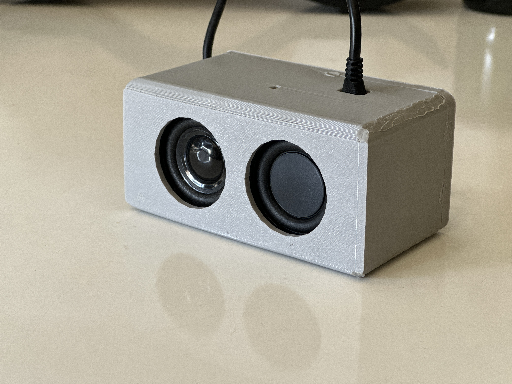

# 🎙️ Roomey AI Voice Agent

  

  

## 🚀 Introducing Roomey

Roomey is an ultra-low latency AI Voice Agent designed to seamlessly integrate into your daily life. With lightning-fast response times and advanced natural language processing, Roomey understands your commands and questions with remarkable accuracy.

### 📺 See Roomey in Action

  

## ✨ Features

- **Ultra-Low Latency**: Get responses in milliseconds, not seconds
- **Natural Conversations**: Engage in fluid, human-like dialogue
- **Web Search**: Find information from the internet instantly
- **Smart Home Control**: Adjust lights and other connected devices
- **Financial Data**: Get real-time stock prices and market information
- **Calendar Integration**: Access your Google Calendar events and appointments
- **Contextual Memory**: Roomey remembers your preferences and previous conversations

## 🔧 Integrations

- **Google Calendar**: Access your schedule and upcoming events
- **Smart Home Devices**: Control lights and other connected devices
- **Financial APIs**: Get real-time stock market data
- **Web Search**: Find information from across the internet

## 🔮 Coming Soon

- **MCP Integration**: Enhanced capabilities through Model Context Protocol
- **Additional Tools**: Expanding Roomey's functionality with more integrations
- **Voice Customization**: Personalize Roomey's voice to your preferences
- **Multi-room Support**: Seamless experience across your entire home

## 🛠️ Technical Architecture

Roomey is built on a modular architecture that allows for easy expansion and customization:

- **Voice Recognition**: Advanced speech-to-text processing
- **Natural Language Understanding**: Contextual comprehension of user requests
- **Agent Framework**: Intelligent decision-making and task execution
- **Integration Layer**: Connects to various services and APIs
- **Voice Synthesis**: Natural-sounding text-to-speech responses

## 🚀 Getting Started

Detailed setup and installation instructions coming soon!

## 📚 Documentation

Explore the `integrations` directory for detailed documentation on each integration module.

## 🤝 Contributing

We welcome contributions to make Roomey even better! More details on how to contribute coming soon.

---

  
   

